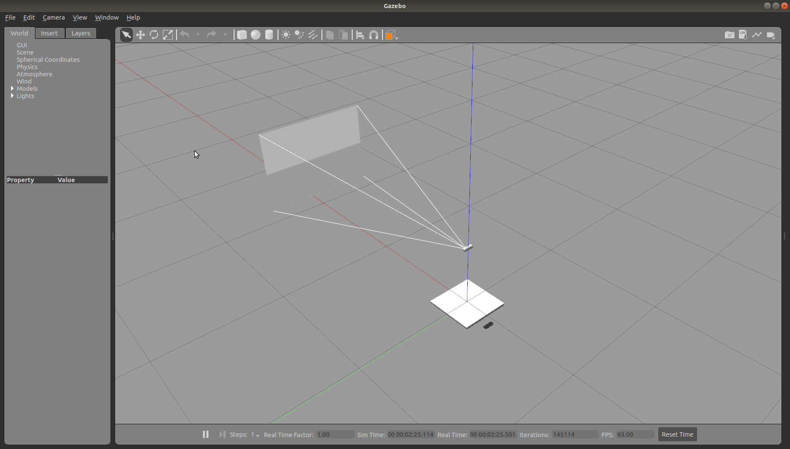
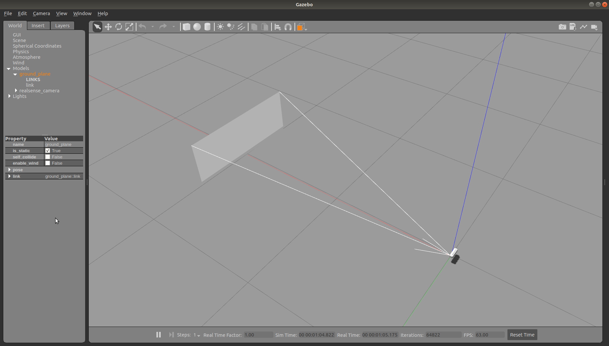
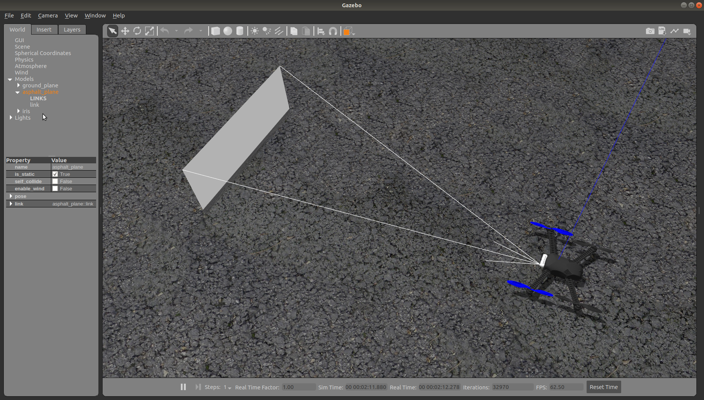
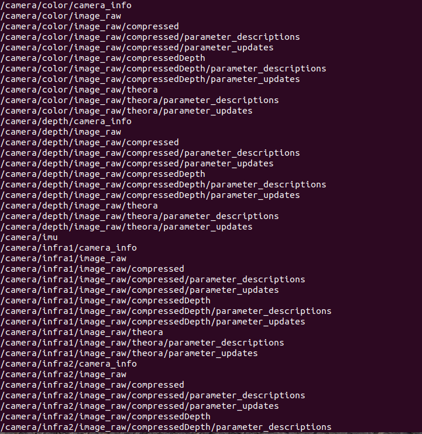
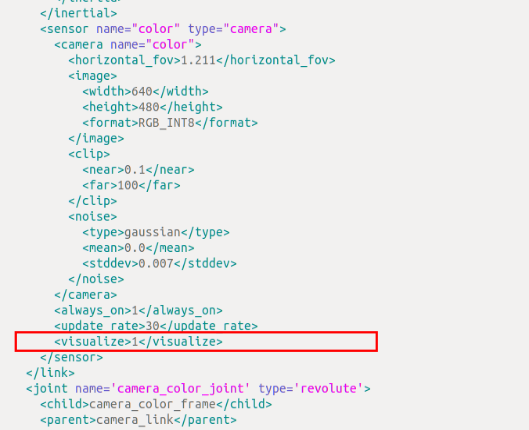
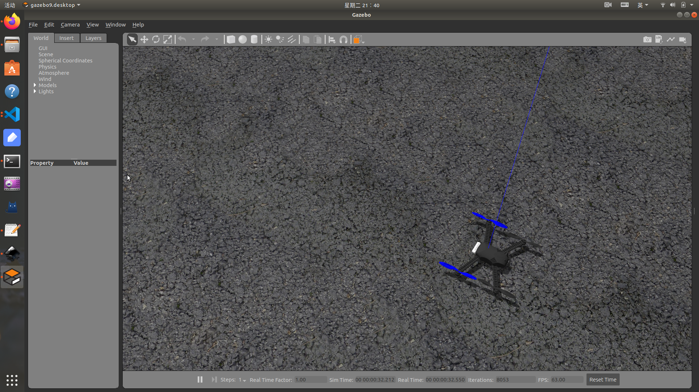
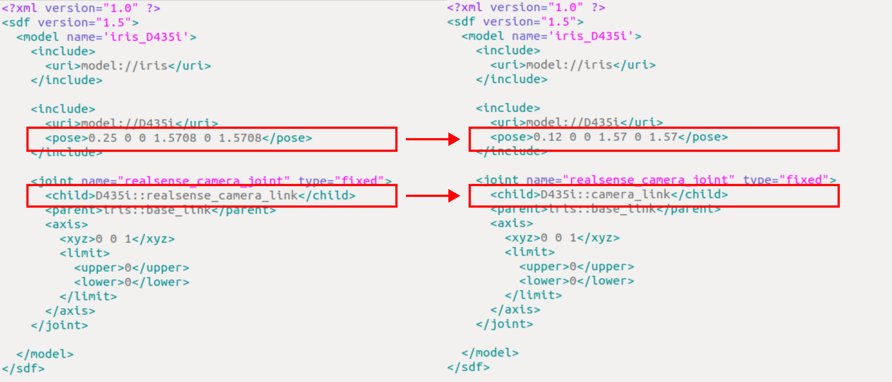

# realsense_ros_gazebo

> 代码fork自[tugepaopaoo/realsense_ros_gazebo: D435i, iris_D435i models in gazebo.](https://github.com/tugepaopaoo/realsense_ros_gazebo)，并作了了一些修改

本仓库提供 d435i 相机模型和 iris_D435i 模型用于在 gazebo 中进行仿真模拟。

**其实，可以直接使用 px4 官方提供的 iris_depth_camera 模型进行无人机仿真。**


## 1. 快速开始

在已经安装 ros、px4 环境的 ubuntu 18.04 上编译测试通过。

```bash
git clone https://github.com/Tfly6/realsense_ros_gazebo.git
cd realsense_ros_gazebo/
catkin build
```

你可以在编译完成后，在当前终端中通过指令快速查看是否编译成功。
```bash
source devel/setup.bash && roslaunch realsense_ros_gazebo simulation.launch
```

<p align="center">
  
</p>


你也可以输入以下命令,进行查看。

```bash
source devel/setup.bash && roslaunch realsense_ros_gazebo simulation_D435i_sdf.launch
```

<p align="center">
  
</p>


## 2. 环境配置

> 配置前请参照 [(最新)ubuntu搭建PX4无人机仿真环境(4) ——仿真环境搭建(以Ubuntu 18.04,ROS1 Melodic 为例)](https://blog.csdn.net/weixin_55944949/article/details/130895608?spm=1001.2014.3001.5502) 这篇博客，搭建好基础仿真环境。
>
> 配置环境，可以在gazebo仿真中加载带有 D435i 的 iris 无人机。

1. 复制相机插件 librealsense_gazebo_plugin.so 到 px4 的动态链接库目录中。

```bash
cd realsense_ros_gazebo/
cp ./devel/lib/librealsense_gazebo_plugin.so ${YOUR_PX4_PATH}/build/px4_sitl_default/build_gazebo/
```

2. 复制相机模型 D435i 、飞机模型 iris_D435i 和launch文件到 px4 中。 

```bash
# model
git apply model.patch
cp -r ./src/realsense_ros_gazebo/sdf/D435i ${YOUR_PX4_PATH}/Tools/sitl_gazebo/models/
cp -r ./src/realsense_ros_gazebo/sdf/iris_D435i ${YOUR_PX4_PATH}/Tools/sitl_gazebo/models/
# launch
cp ./src/realsense_ros_gazebo/launch/mavros_posix_sitl_D435i.launch ${YOUR_PX4_PATH}/launch
```


## 3. 启动 Gazebo 仿真

```bash
 source ~/.bashrc
 roslaunch px4 mavros_posix_sitl_D435i.launch
```

终端中输入命令，即可在 gazebo 看见 iris_D435i.sdf 模型。

<p align="center">
  
</p>
新开一个终端通过 `rostopic list`，即可查看到相机的相关话题消息（检查关键话题没有缺少即可）。

```bash
/camera/color/camera_info
/camera/color/image_raw
/camera/depth/camera_info
/camera/depth/image_raw
/camera/imu
/camera/infra1/camera_info
/camera/infra1/image_raw
/camera/infra2/camera_info
/camera/infra2/image_raw
```


<p align="center">
  
</p>


## 4. 其他

### 相机前方的图像界面显示调整

通过对相机模型 `D435i.sdf` 文件中图示属性的调整，可以选择 `显示` 或 `隐藏` 相机前方的实时相机界面。 

- `<visualize>1</visualize>` 时为 `显示`；
- `<visualize>0</visualize>` 时为 `隐藏`；


<p align="center">
  
</p>


隐藏时的效果如下：

<p align="center">
  
</p>


### 对[原仓库](https://gitee.com/nie_xun/realsense_ros_gazebo?_from=gitee_search)文件的修改说明

只对原仓库中 `iris_D435i.sdf` 文件进行了修改。

<p align="center">
  
</p>

- 将 `<pose>0.25 0 0 1.5708 0 1.5708</pose>` 修改为`<pose>0.12 0 0 1.5708 0 1.5708</pose>` 

- 将 `<child>D435i::realsense_camera_link</child>` 修改为 `<child>D435i::camera_link</child>`